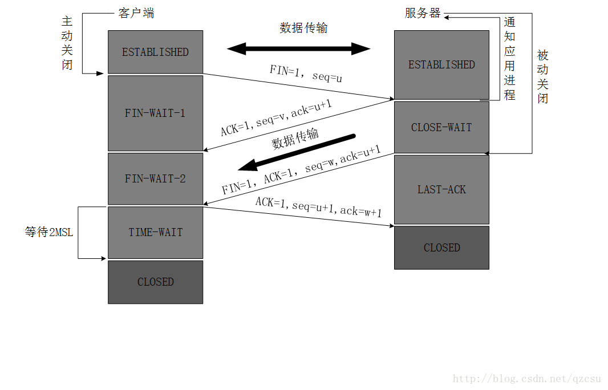
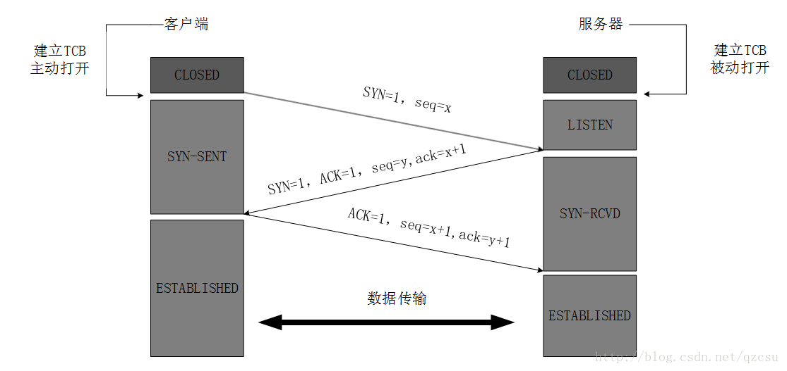

### Http与Https的对比
1. http通信使用明文，内容可能被窃听
2. 不验证通信方的身份，有可能遭到伪装
3. 无法验证明文的完整性，可能已经遭到篡改

**Https=加密+认证+完整性保护**

---

### 网络基础
#### TCP/IP协议
- 把与互联网相关的协议集合起来的总称
- 应用层（FTP、DNS、HTTP）、传输层（TCP、UDP）、网络层（IP）、数据链路层
- 数据传输时候的封装
- IP协议：负责传输，IP地址和MAC地址（ARP协议：解析地址）
- TCP三次握手
    - Client发送带有SYN标志的数据包给对方
    - 接收端收到并回传一个STYN／ACK标志的数据包
    - Client最后回传一个ACK的数据包，表示握手结束

- 为什么TCP客户端最后还要发送一次确认呢？
一句话，主要防止已经失效的连接请求报文突然又传送到了服务器，从而产生错误。
  
  如果使用的是两次握手建立连接，假设有这样一种场景，客户端发送了第一个请求连接并且没有丢失，只是因为在网络结点中滞留的时间太长了，由于TCP的客户端迟迟没有收到确认报文，以为服务器没有收到，此时重新向服务器发送这条报文，此后客户端和服务器经过两次握手完成连接，传输数据，然后关闭连接。此时此前滞留的那一次请求连接，网络通畅了到达了服务器，这个报文本该是失效的，但是，两次握手的机制将会让客户端和服务器再次建立连接，这将导致不必要的错误和资源的浪费。
  
  如果采用的是三次握手，就算是那一次失效的报文传送过来了，服务端接受到了那条失效报文并且回复了确认报文，但是客户端不会再次发出确认。由于服务器收不到确认，就知道客户端并没有请求连接。
  
- TCP四次挥手
[解释](https://blog.csdn.net/qzcsu/article/details/72861891)

-  URL：uniform resource location 统一资源定位符
-  URI：uniform resource identifier 统一资源标识

---
<!-- more -->

### HTTP协议(无状态协议)
#### HTTP报文：用于HTTP协议交互的信息（报文首部+报文主体）
- 报文主体用于传输实体主体，通常情况下，报文主体等于实体主体，只有在传输过程中进行编码操作时，实体主体内容发生变化，导致与报文主体发生差异
- 内容编码：由客户端解码（gzip、compress、deflate、identify）
- 分块传输编码：把实体主体分块，由客户端负责解码
- 获取部分范围内的请求：首部字段Range，成功206 Partial Content 否则200 OK
- 内容协商

---

#### 请求报文：方法+请求URI+协议版本号+可选请求首部+内容实体
1. 方法
- GET：用于请求资源
- POST：用于传输实体的主体
- PUT：用于传输文件（204 No Content，已存在）
- HEAD：获得报文首部，用于确认URI有效期以及资源的更新日期等
- DELETE：删除文件，与PUT相反（204 No Content，已删除）
- OPTIONS：询问支持的方法
- TRACE：用于追踪路径，Max-Forwards
- CONNECT：要求用隧道协议连接代理（要求在与代理服务器通信时建立隧道，实现用隧道协议进行TCP通信，主要是通过SSL和TLS协议把通信内容加密后通过网络隧道传输）
2. 使用方法下达命令
3. 持久连接：Keep-alive，只要任意一端没有明确表示要断开，就保持TCP连接状态
- 优点：在于减少了 TCP 连接的重复建立和断开所造成的 额外开销,减轻了服务器端的负载。另外,减少开销的那部分时间,使 HTTP 请求和响应能够更早地结束,这样 Web 页面的显示速度也就相应 提高了。
4. Pipeling：同时并行发送多个请求

---

#### 响应报文：协议版本+状态码+解释状态吗的状态短语+可选响应首部+内容实体

---

### 通信数据转发程序:代理、网关、隧道
代理：转发时,需要附加 Via 首部字段以标记出经过的主机信息。
- 利用缓存技术减少网络带宽的流量，组织内部针对特定网址的访问控制，以获取访问日志为目的

网管：利用网关可以由 HTTP 请求转化为其他协议通信，提高通信的安全性。

隧道：隧道的目的是确保客户端能与服务器（远距离）进行安全的通信。

---

### 首部
#### 通用报文首部
- Cache-Control：缓存机制
  - 缓存请求指令：no-cache,no-store,max-age,max-stale,**only-if-cached**(客户端仅在缓存服务器本地缓存目标资源的情况下才会返回，否则504 Gateway Timeout)
  - 混存响应指令：public,private,no-cache,no-store,must-revalidate,proxy-revalidate
- Upgrade：用于检测HTTP协议以及其他协议是否可使用更高的版本进行通信，参数可以是一个完全不同的协议
- Connection：控制不再转发给代理的首部名称，管理持久链接
- Date：报文创建的时间
- Pragma：要求所有的中间服务器不返回缓存的资源
- Trailer：事先说明报文主体里有哪些首部字段
- Transfer-Encoding
- Via：为了追踪传输路径，通常与trace一起使用

---

#### 请求报文首部
- Accept
- Accetpt-Charset
- Accept-Language
- Accept-Encoding
- Authorization：用于告知服务器，用户代理的认证信息
- Expect：（否则417）
- From：邮箱
- Host
- If-Match：与ETag相互配合使用
- If-Modified-Since
- If-None-Match
- If-Range
- If-Unmodified-Since
- Max-Forwards
- Proxy-Authorization
- Range
- Referer：URI
- User-Agent

---

#### 响应报文首部
- Accept-Ranges：bytes|none
- Age
- ETag：告知客户端实体标识
- Location：URI
- Proxy-Authenticate
- Retry-After
- Server
- Vary：对缓存进行控制
- WWW-Authenticate

---

#### 实体首部字段
- Allow
- Content-Encoding
- Content-Language
- Content-Length
- Content-Location
- Content-MD5
- Content-Range
- Content-Types
- Expires
- Last-Modified

---

#### Cookie相关
- 响应首部字段：Set-Cookie
- 请求首部字段：Cookie
- 字段：name,value,domain,path,expires,secure(只有在HTTPS安全通信是才发送Cookie),HttpOnly（使js无法获得Cookie，防止XSS）

---

### 状态码

状态码   | 类别 | 原因短语
---|---|---
1XX | Informational（信息类状态码）| 接受的请求正在处理
2XX | Success（成功状态码）| 请求正常处理完毕
3XX | Redirection（重定向状态码） | 需要附加操作才能完成请求
4XX | Client Error （客户端出错）| 服务器端无法处理请求
5XX | Server Error（服务端报错）| 服务器端处理请求报错

---

#### 204 No Content
成功处理，但在返回的响应报文中不包括实体的主体部分
一般用于从客户端向服务器端发送信息，而对客户端不需要发送新信息的情况，例如PUT、DELEDTE
#### 206 Partial Content
表示客户端进行了范围请求，而服务器端成功地执行了这部分请求，响应报文中包含由Content-Range指定范围内的实体内容

---

#### 301 Move Permanently
永久性重定向，更新URI
#### 302 Found
临时重定向，本次更新URI
#### 303 See Other
表示请求的资源存在另一个URI，应使用GET获取资源
#### 304 Not Modified
不包含任何响应的主体部分，一般和缓存相关的首部配合使用（Cacha-Control、If-Modified-Since）
#### 307 Temporary Redirect
临时重定向，与302不同，307不会把POST改成GET
一般301 302 303返回时，基本上所有的浏览器都会把POST更换成GET方法，并删除请求报文中的主体，之后请求会自动再发送

---

#### 400 Bad Request
请求报文中出现语法错误
#### 401 Unauthorized
表示发送的请求需要有通过HTTP认证的信息。包含401的响应必须包含一个适用于被请求资源的WWW-Authenticate的首部用于质询用户信息
浏览器收到401响应，会弹出认证用的对话窗口
#### 403 Fobidden
访问被拒绝
#### 404 Not Found
找不到请求的资源

---

#### 501 Internal Server Error
服务器端在执行请求时候发生了错误
#### 503 Service Unavaible
服务器端负载超荷活着在维护，无法处理请求。如果知道处理状况的时间，最好加上Retry-After的首部返回客户端
